# Swift Craft Launcher — 设计图与流程图

> 本文档用于说明软件总体架构、功能模块划分及主要业务流程。图中模块命名与工程目录（`CommonFeature` / `PlayerFeature` / `GameFeature` / `ModPackFeature` 等）对应。

---

## 1. 系统总体架构

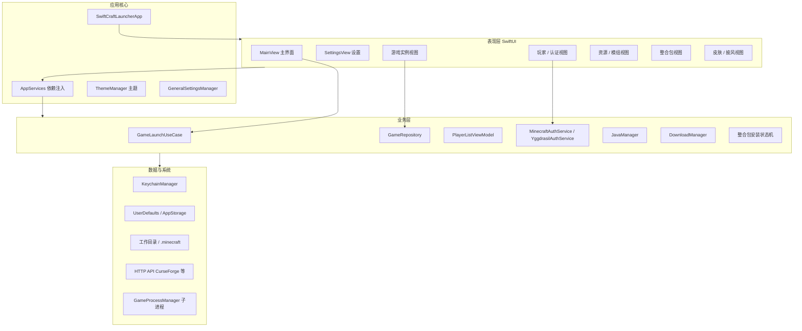

---

## 2. 功能模块结构图

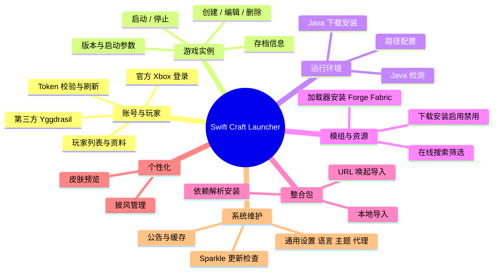

---

## 3. 主界面信息架构

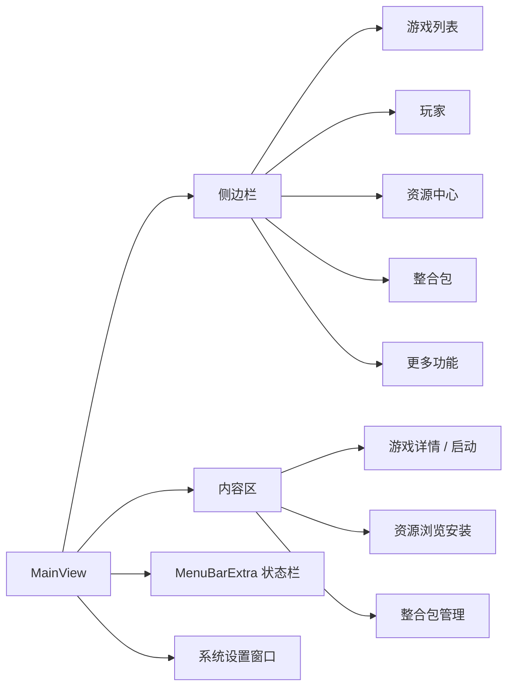

---

## 4. 应用启动流程

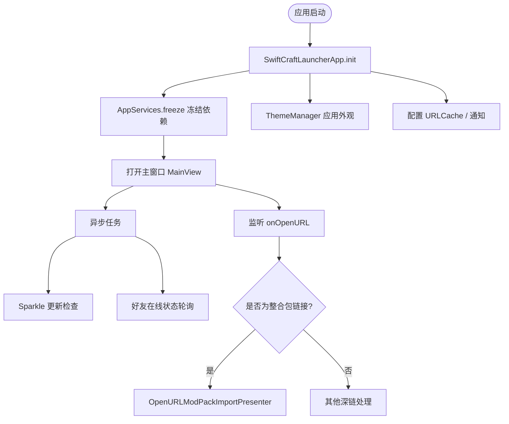

---

## 5. 账号登录认证流程

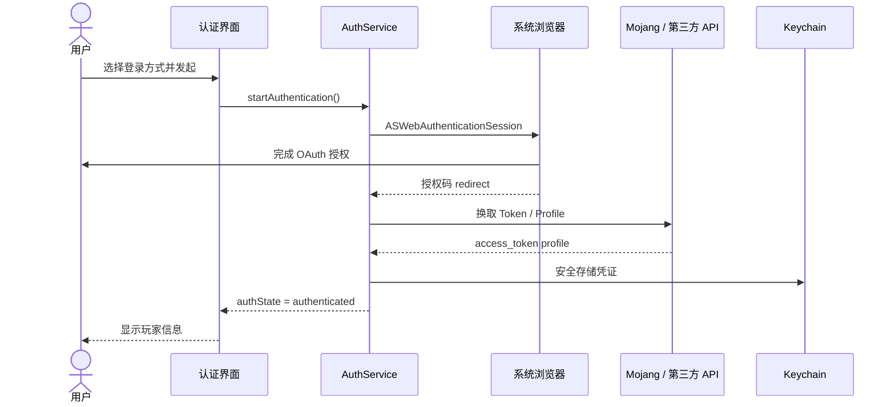

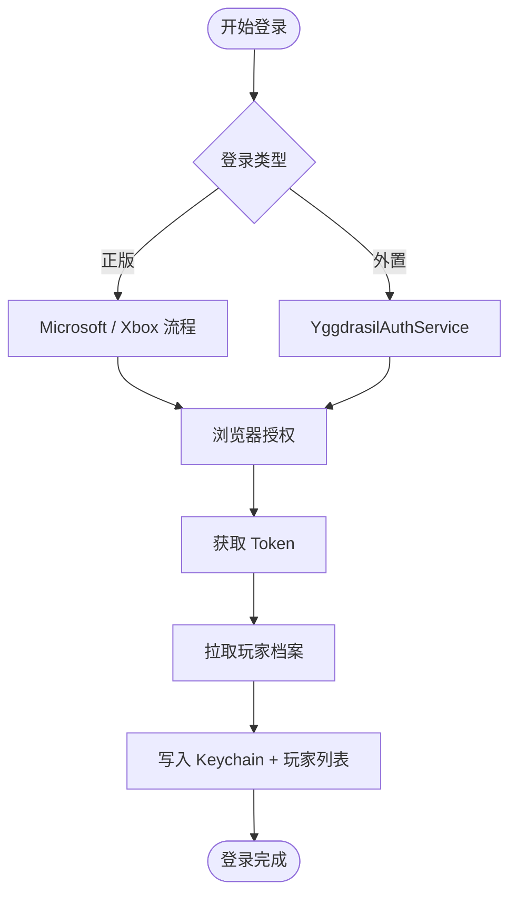

---

## 6. 游戏实例管理流程

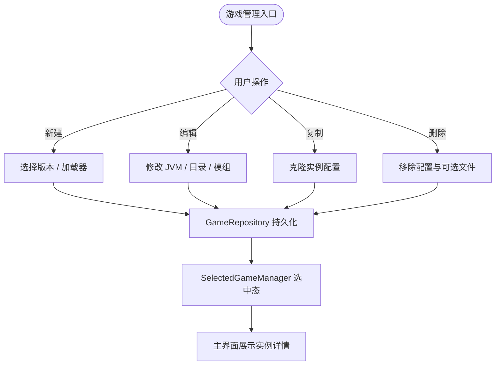

---

## 7. 游戏启动流程

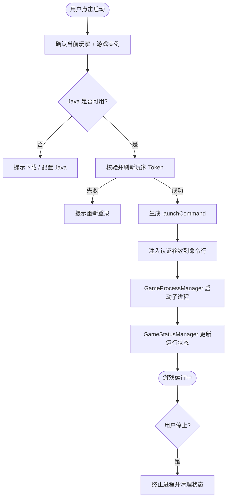

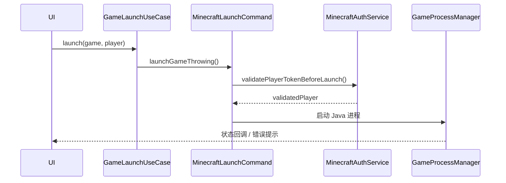

---

## 8. Java 运行时获取与配置

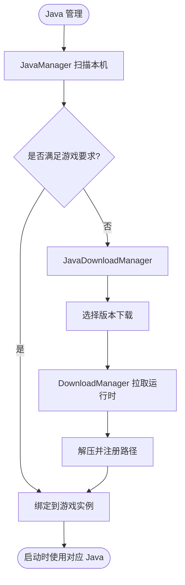

---

## 9. 模组加载器与在线资源安装

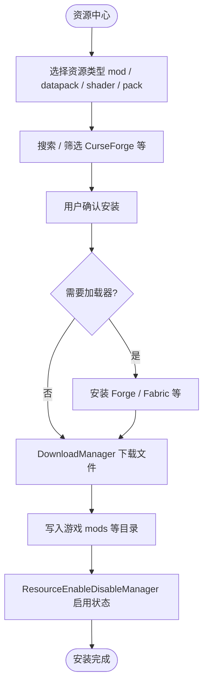

---

## 10. 整合包导入安装流程

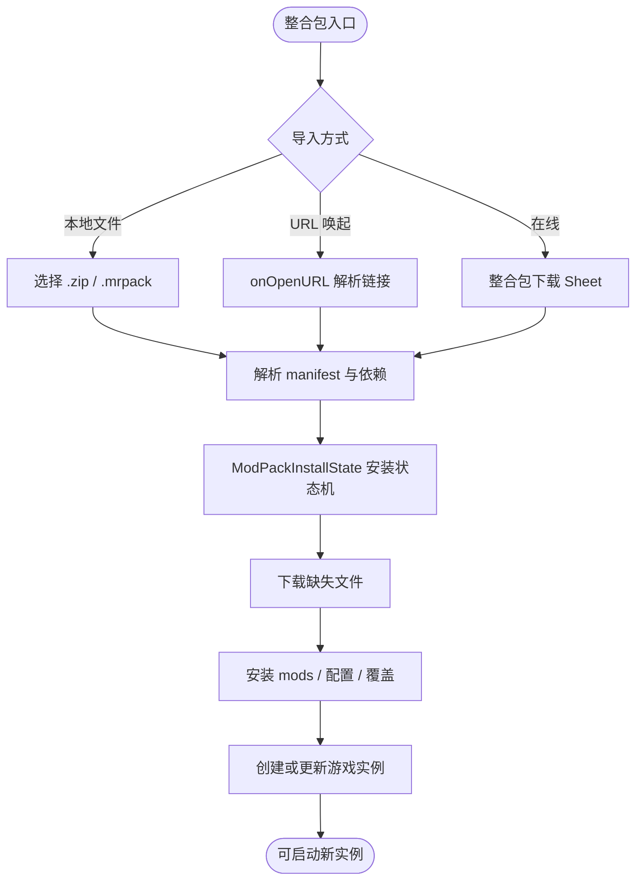

---

## 11. 皮肤与披风管理

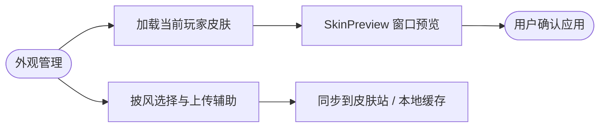

---

## 12. 更新检查与通用设置

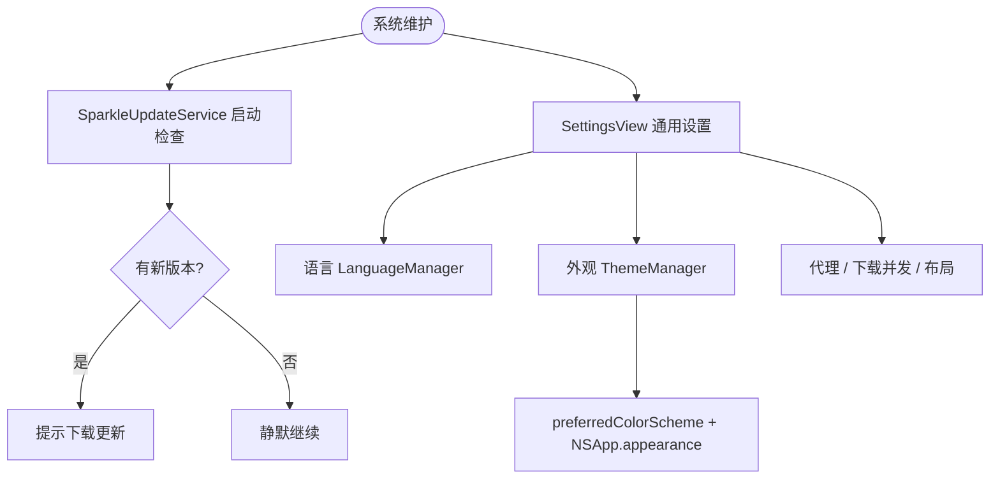

### 主题切换子流程

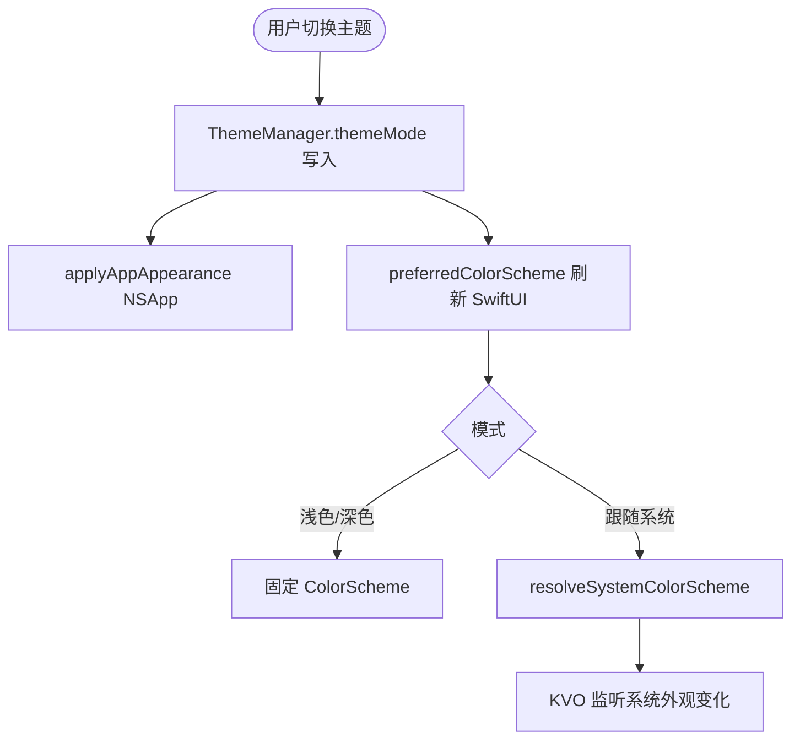

---

## 13. 核心数据流（简化）

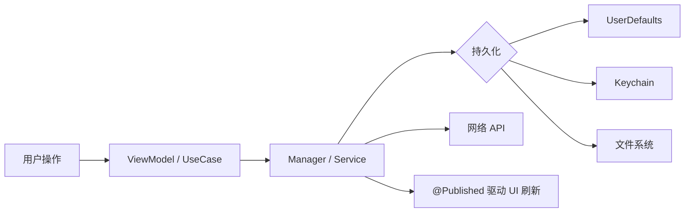

---

## 14. 部署与运行环境

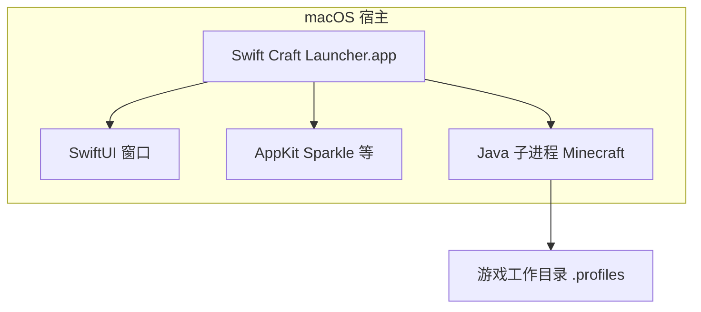
