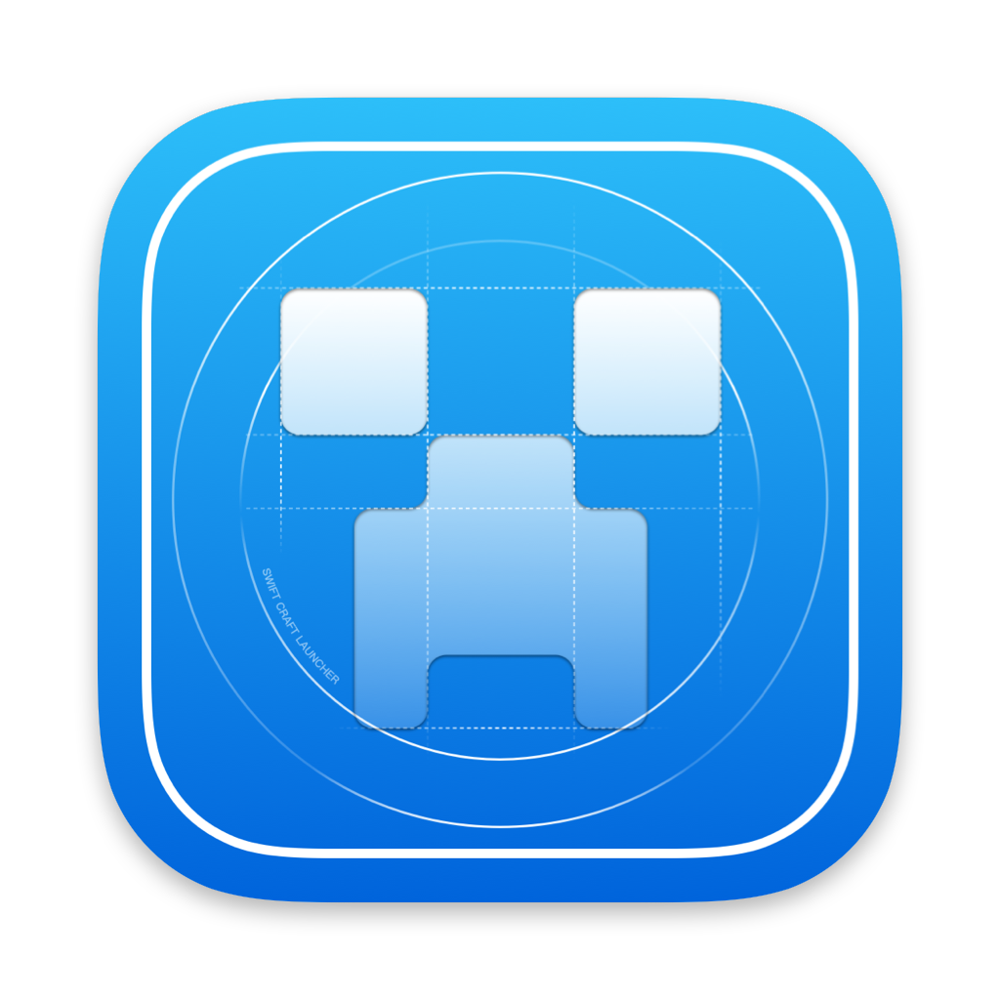

<div align="center">
  
  
  # 🚀 Swift Craft Launcher
  
  **✨ A modern Minecraft launcher for macOS ✨**
  
  [](https://github.com/suhang12332/Swift-Craft-Launcher)
  [](https://swift.org/)

  [](https://qm.qq.com/cgi-bin/qm/qr?k=1057517524)
  [](https://discord.com/invite/db7BEh6k)

  [](https://www.gnu.org/licenses/agpl-3.0)
  [](https://github.com/suhang12332/Swift-Craft-Launcher/releases/latest)
  [](https://developer.apple.com/macos/)
  [](https://formulae.brew.sh/cask/swiftcraft-launcher)
  [](https://github.com/suhang12332/Swift-Craft-Launcher/graphs/contributors)
  
  🌐 [Website](https://suhang12332.github.io/Swift-Craft-Launcher-Assets/web/) • 💾 [Download](https://github.com/suhang12332/Swift-Craft-Launcher/releases/latest) • 📚 [Documentation](https://suhang12332.github.io/Swift-Craft-Launcher-Assets/web/)
  
  [🇨🇳简体中文](../README.md) | [🇭🇰繁體中文](README_zh-TW.md) | **🇬🇧English**
</div>

---

## 🎯 Overview

Swift Craft Launcher is a native macOS Minecraft launcher 🍎 built with SwiftUI, offering a streamlined and efficient gaming experience. Designed for modern macOS systems, it provides comprehensive mod loader support, Microsoft account authentication, and intuitive game management.

<div align="center">
  
</div>

## ✨Key Features

### 🧩 Core Functionality
- **🔄 Multi-version Minecraft Support** - ARM: 1.13+, Intel: untested
- **🔐 Microsoft Account Authentication** - Secure OAuth integration with device code flow
- **🧰 Mod Loader Support** - Fabric, Quilt, Forge, and NeoForge with automatic installation
- **📦 Resource Management** - One-click installation of mods, datapacks, shaders, and resource packs

### 💻 User Experience
- **🎨 Native macOS Design** - SwiftUI-based interface following Apple Human Interface Guidelines
- **🌍 Multi-language Support** - Localized interface with flag indicators
- **🗂️ Smart Path Management** - Finder-style breadcrumb navigation with auto-truncation of long paths
- **⚡ Performance Optimization** - Efficient caching and memory management mechanisms

### ⚙️ Advanced Configuration
- **☕ Java Management** - Per-profile Java path configuration with automatic version detection
- **🧠 Memory Allocation** - Visual range slider for Xms/Xmx parameter settings
- **🔧 Custom Launch Parameters** - JVM and game argument customization

## 📋 System Requirements

- **💻 macOS**: 14.0 or later
- **☕️ Java**: 8 or later (for Minecraft runtime)

## 📥 Installation

### 🍺 Using Homebrew Tap (Recommended)
```bash
# Method 1: One-command install
brew install --cask suhang12332/swiftcraftlauncher/swift-craft-launcher

# Method 2: Add Tap then install
brew tap suhang12332/swiftcraftlauncher
brew install --cask swift-craft-launcher
```

> **💡 Tip**: We created a dedicated [Homebrew Tap](https://github.com/suhang12332/homebrew-swiftcraftlauncher) for Swift Craft Launcher

### 💾 Pre-built Release
Download the latest version from [GitHub Releases](https://github.com/suhang12332/Swift-Craft-Launcher/releases/latest).

> **⚠️ Note**: The current available downloads are test versions. Stable releases are coming soon.

### ❓ Frequently Asked Questions
Please visit [FAQ](../doc/FAQ.md)

### 🔨 Build from Source
1. **⏬ Clone the repository**
   ```bash
   git clone https://github.com/suhang12332/Swift-Craft-Launcher.git
   cd Swift-Craft-Launcher
   ```

2. **🛠️ Open in Xcode**
   ```bash
   open SwiftCraftLauncher.xcodeproj
   ```

3. **🚀 Build and run** using Xcode (⌘R)

**Build Requirements:**
- Xcode 13.0+
- Swift 5.5+

## 🧪 Technical Architecture

| Component | Technology |
|-----------|------------|
| **🎨 UI Framework** | SwiftUI |
| **💻 Language** | Swift |
| **🔄 Reactive Programming** | Combine |
| **📱 Target Platform** | macOS 14.0+ |

## 📜 License

This project is licensed under the GNU Affero General Public License v3.0. See [LICENSE](../LICENSE) for details.

**Additional Terms**: This project includes additional terms requiring source attribution and prohibiting the use of the same software name. See:
- [简体中文](ADDITIONAL_TERMS.md)
- [繁體中文](ADDITIONAL_TERMS_zh-TW.md)
- [English](ADDITIONAL_TERMS_en.md)

## 🤝 Community & Support

- **👥 Official QQ Group**: [1057517524](https://qm.qq.com/cgi-bin/qm/qr?k=1057517524)
- **Discord**: [Discord](https://discord.com/invite/db7BEh6k)
- **🐛 Issue Reports**: [GitHub Issues](https://github.com/suhang12332/Swift-Craft-Launcher/issues)
- **💡 Feature Suggestions**: [GitHub Discussions](https://github.com/suhang12332/Swift-Craft-Launcher/discussions)

## 🌟 Contributing

We welcome contributions! Please see our [Contributing Guidelines](../CONTRIBUTING.md) for details on:
- Code style and standards
- Pull request process
- Issue reporting guidelines

## 🙏 Acknowledgments

Special thanks to the following projects that have contributed to this launcher:

- **[Archify](https://github.com/Oct4Pie/archify)** - Universal binary optimization tool for macOS applications

---

<div align="center">
  <strong>🎮 Made with ❤️ for the Minecraft community</strong>
</div>
