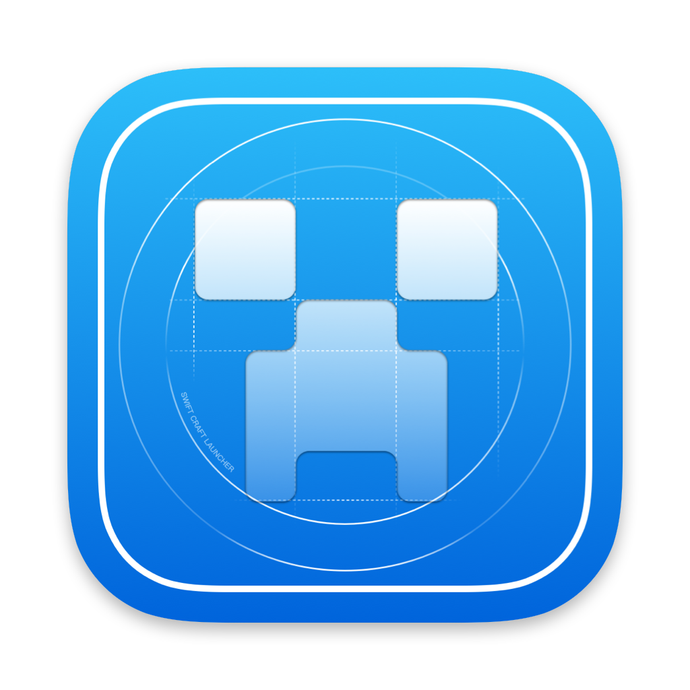

<div align="center">
  
  
  # 🚀 Swift Craft Launcher
  
  **✨ 现代化的 macOS Minecraft 启动器 ✨**
  
  [](https://github.com/suhang12332/Swift-Craft-Launcher)
  [](https://swift.org/)

  [](https://qm.qq.com/cgi-bin/qm/qr?k=1057517524)
  [](https://discord.gg/gYESVa3CZd)

  [](https://www.gnu.org/licenses/agpl-3.0)
  [](https://github.com/suhang12332/Swift-Craft-Launcher/releases/latest)
  [](https://developer.apple.com/macos/)
  [](https://formulae.brew.sh/cask/swiftcraft-launcher)
  [](https://github.com/suhang12332/Swift-Craft-Launcher/graphs/contributors)
  
  🌐 [官网](https://suhang12332.github.io/Swift-Craft-Launcher-Assets/web/) • 💾 [下载](https://github.com/suhang12332/Swift-Craft-Launcher/releases/latest) • 📚 [文档](https://suhang12332.github.io/Swift-Craft-Launcher-Assets/web/)
  
  [🇬🇧 English](../README.md) | **🇨🇳 简体中文** | [🇭🇰 繁體中文](README_zh-TW.md)
</div>

---

## 🎯 项目概述

Swift Craft Launcher 是一款采用 SwiftUI 构建的原生 macOS Minecraft 启动器 🍎，提供流畅高效的游戏体验。专为现代 macOS 系统设计，集成全面的模组加载器支持、Microsoft 账户认证和直观的游戏管理功能。

<div align="center">
  
</div>
<div align="center">
  
</div>

## ✨ 核心特性

### 🧩 基础功能
- **🔄 多版本 Minecraft 支持** - ARM: 1.13+，Intel: 未测试
- **🔐 Microsoft 账户认证** - 安全的 OAuth 集成，支持设备代码流程
- **🧰 模组加载器支持** - 支持 Fabric、Quilt、Forge 和 NeoForge 自动安装
- **📦 资源管理** - 一键安装模组、数据包、光影和资源包

### 💻 用户体验
- **🎨 原生 macOS 设计** - 基于 SwiftUI，遵循 Apple 人机界面指南
- **🌍 多语言支持** - 本地化界面，支持国旗标识
- **🗂️ 智能路径管理** - Finder 风格的面包屑导航，自动截断长路径
- **⚡ 性能优化** - 高效的缓存和内存管理机制

### ⚙️ 高级配置
- **☕ Java 管理** - 每个配置文件独立的 Java 路径配置，版本自动检测
- **🧠 内存分配** - 可视化范围滑块设置 Xms/Xmx 参数
- **🔧 自定义启动参数** - JVM 和游戏参数自定义

## 📋 系统要求

- **💻 macOS**: 14.0 或更高版本
- **☕ Java**: 8 或更高版本（用于 Minecraft 运行时）

## 📥 安装方式

### 🍺 使用 Homebrew Tap (推荐)
```bash
# 方法 1：一键安装

brew install --cask suhang12332/swiftcraftlauncher/swift-craft-launcher

# 方法 2：添加 Tap 后安装

brew tap suhang12332/swiftcraftlauncher
brew install --cask swift-craft-launcher
```

> **💡 提示**: 我们为 Swift Craft Launcher 创建了专用的 [Homebrew Tap](https://github.com/suhang12332/homebrew-swiftcraftlauncher)

### 💾 预编译版本
从 [GitHub Releases](https://github.com/suhang12332/Swift-Craft-Launcher/releases/latest) 下载最新版本。

> **⚠️ 注意**: 当前可下载的版本均为测试版本，稳定版本即将发布。

### ❓ 常见问题
请访问 [FAQ](FAQ.md)

### 🔨 从源码构建
1. **📥 克隆仓库**
  ```bash
   git clone https://github.com/suhang12332/Swift-Craft-Launcher.git
   cd Swift-Craft-Launcher
  ```

2. **🛠️ 在 Xcode 中打开**
  ```bash
   open SwiftCraftLauncher.xcodeproj
  ```

3. **🚀 构建并运行** 使用 Xcode (⌘R)

**构建要求：**
- Xcode 13.0+
- Swift 5.5+

## 🧪 技术架构

| 组件 | 技术 |
|------|------|
| **🎨 UI 框架** | SwiftUI |
| **💻 开发语言** | Swift |
| **🔄 响应式编程** | Combine |
| **📱 目标平台** | macOS 14.0+ |

## 📜 开源协议

本项目采用 GNU Affero General Public License v3.0 开源协议。详细信息请查看 [LICENSE](../LICENSE) 文件。

**附加条款**：本项目包含附加条款，要求声明来源并禁止使用相同软件名称。详细信息请查看：
- [简体中文](ADDITIONAL_TERMS.md)
- [繁體中文](ADDITIONAL_TERMS_zh-TW.md)
- [English](ADDITIONAL_TERMS_en.md)

## 🤝 社区与支持

- **👥 官方 QQ 群**: [1057517524](https://qm.qq.com/cgi-bin/qm/qr?k=1057517524)
- **Discord**: [Discord](https://discord.gg/gYESVa3CZd)
- **🐛 问题反馈**: [GitHub Issues](https://github.com/suhang12332/Swift-Craft-Launcher/issues)
- **💡 功能建议**: [GitHub Discussions](https://github.com/suhang12332/Swift-Craft-Launcher/discussions)

## 🌟 参与贡献

我们欢迎各种形式的贡献！请查看我们的 [贡献指南](../CONTRIBUTING.md) 了解以下内容：
- 代码风格和标准
- Pull Request 流程
- 问题报告指南

## 🙏 致谢

特别感谢以下项目对本启动器的贡献：

- **[Archify](https://github.com/Oct4Pie/archify)** - macOS 应用程序通用二进制优化工具

- **[curseforge-fingerprint](https://github.com/meza/curseforge-fingerprint)** - CurseForge 模组文件指纹算法封装

---

<div align="center">
  <strong>🎮 为 Minecraft 社区用心制作 ❤️</strong>
</div>
