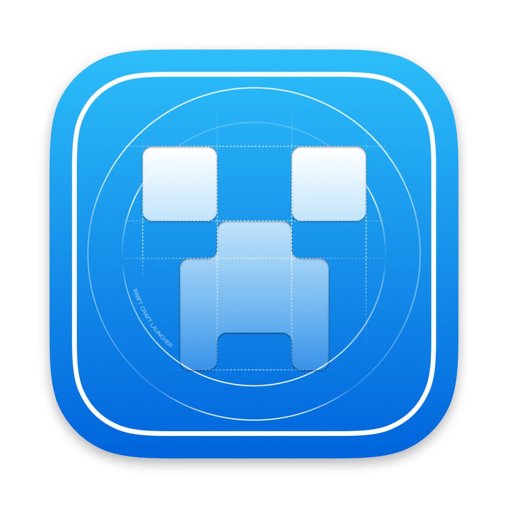

<div align="center">
  
  
  # SwiftCraft Launcher
  
  **現代化的 macOS Minecraft 啟動器**
  
  [](https://github.com/suhang12332/Swift-Craft-Launcher)
  [](https://swift.org/)
  [](https://qm.qq.com/cgi-bin/qm/qr?k=1057517524)
  
  [](https://www.gnu.org/licenses/agpl-3.0)
  [](https://github.com/suhang12332/Swift-Craft-Launcher/releases/latest)
  [](https://developer.apple.com/macos/)
  [](https://github.com/suhang12332/Swift-Craft-Launcher/graphs/contributors)
  
  [官網](https://suhang12332.github.io/swift-craft-launcher-web.github.io/) • [下載](https://github.com/suhang12332/Swift-Craft-Launcher/releases/latest) • [文檔](https://github.com/suhang12332/Swift-Craft-Launcher/wiki)
  
  [简体中文](../README.md) | **繁體中文** | [English](README_en.md)
</div>

---

## 專案概述

Swift Craft Launcher 是一款採用 SwiftUI 構建的原生 macOS Minecraft 啟動器，提供流暢高效的遊戲體驗。專為現代 macOS 系統設計，整合全面的模組載入器支援、Microsoft 帳戶認證和直觀的遊戲管理功能。

<div align="center">
  
</div>

## 核心特色

### 基礎功能
- **多版本 Minecraft 支援** - ARM: 1.19+，Intel: 未測試
- **Microsoft 帳戶認證** - 安全的 OAuth 整合，支援裝置代碼流程
- **模組載入器支援** - Fabric、Quilt、Forge 和 NeoForge，自動安裝
- **資源管理** - 一鍵安裝模組、資料包、光影和資源包

### 使用體驗
- **原生 macOS 設計** - 基於 SwiftUI，遵循 Apple 人機介面指南
- **多語言支援** - 本地化介面，支援國旗標識
- **智慧路徑管理** - Finder 風格的麵包屑導航，自動截斷長路徑
- **效能最佳化** - 高效的快取和記憶體管理機制

### 進階設定
- **Java 管理** - 每個設定檔獨立的 Java 路徑配置，版本自動偵測
- **記憶體分配** - 視覺化範圍滑桿設定 Xms/Xmx 參數 *(即將推出)*
- **自訂啟動參數** - JVM 和遊戲參數自訂 *(即將推出)*

## 系統需求

- **macOS**: 14.0 或更高版本
- **Java**: 8 或更高版本（用於 Minecraft 執行時）

## 安裝方式

### 預編譯版本
從 [GitHub Releases](https://github.com/suhang12332/Swift-Craft-Launcher/releases/latest) 下載最新版本。

> **⚠️ 注意**: 當前可下載的版本均為測試版本，穩定版本即將發佈。

### 從原始碼建置
1. **複製儲存庫**
   ```bash
   git clone https://github.com/suhang12332/Swift-Craft-Launcher.git
   cd Swift-Craft-Launcher
   ```

2. **在 Xcode 中開啟**
   ```bash
   open SwiftCraftLauncher.xcodeproj
   ```

3. **建置並執行** 使用 Xcode (⌘R)

**建置需求：**
- Xcode 13.0+
- Swift 5.5+

## 技術架構

| 元件 | 技術 |
|------|------|
| **UI 框架** | SwiftUI |
| **開發語言** | Swift |
| **反應式程式設計** | Combine |
| **目標平台** | macOS 14.0+ |

## 開源授權

本專案採用 GNU Affero General Public License v3.0 開源授權。詳細資訊請查看 [LICENSE](../LICENSE) 檔案。

## 社群與支援

- **官方 QQ 群**: [1057517524](https://qm.qq.com/cgi-bin/qm/qr?k=1057517524)
- **問題回報**: [GitHub Issues](https://github.com/suhang12332/Swift-Craft-Launcher/issues)
- **功能建議**: [GitHub Discussions](https://github.com/suhang12332/Swift-Craft-Launcher/discussions)

## 參與貢獻

我們歡迎各種形式的貢獻！請查看我們的 [貢獻指南](../CONTRIBUTING.md) 了解以下內容：
- 程式碼風格和標準
- Pull Request 流程
- 問題回報指南

## 致謝

特別感謝以下專案對本啟動器的貢獻：

- **[Archify](https://github.com/Oct4Pie/archify)** - macOS 應用程式通用二進位最佳化工具

---

<div align="center">
  <strong>為 Minecraft 社群用心製作 ❤️</strong>
</div>
