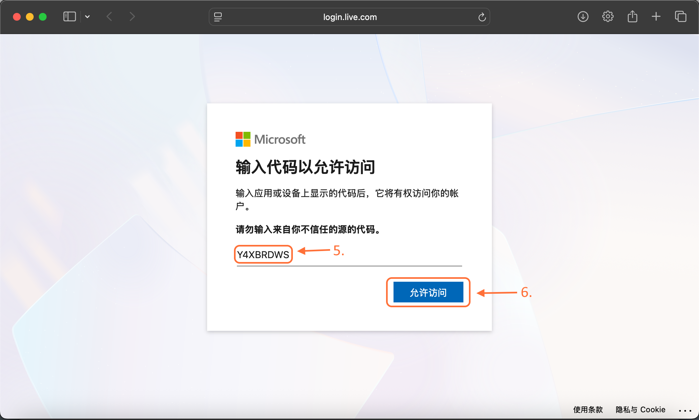

# Login Accounts
SCL supports three main login methods: Offline Mode, Microsoft Official Login, and LittleSkin Login.

## 1.1 Offline Mode
> No internet verification required. Enter any username to start the game. Only suitable for single-player mode or servers with online authentication disabled.
- 1. Click "Add Player"

- 2-4. Select the "Offline" option in the top right, enter your desired player name, and click "Create Account"
  
- 5. When your player information appears in the bottom left of the launcher, the account has been added successfully

## 1.2 Microsoft Login
> Authenticate using your official Microsoft account. This is the only way to access all official Minecraft features. You must own a purchased copy of Minecraft to use this method.
- 1. Click "Add Player"

- 2-3. Select the "Microsoft" option in the top right and click "Start Login"

- 4. Click to allow opening the browser, then follow the instructions on the webpage to log in to your Microsoft account and authorize SCL

- 5. Return to the launcher and confirm the addition

- 6. When your player information appears in the bottom left of the launcher, the account has been added successfully

## 1.3 LittleSkin Login
> A third-party login method. Authenticate using an account provided by the LittleSkin skin site, commonly used for custom skins and capes. Only supports single-player mode and servers that support this login method.
- LittleSkin login is under development. Stay tuned...